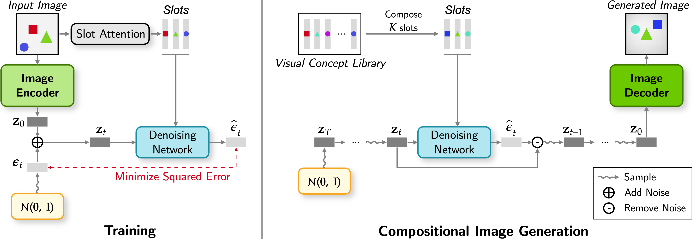
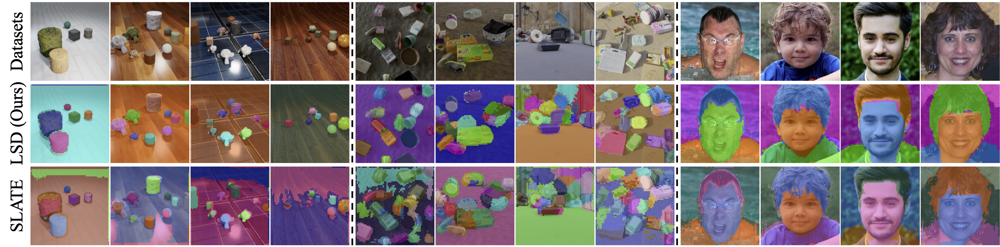
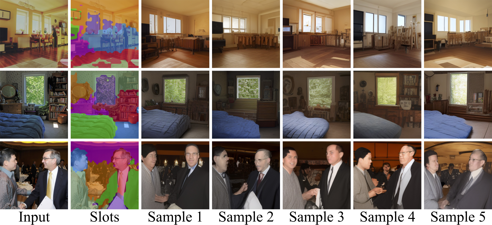

# LSD: Object-Centric Slot Diffusion
This is an official PyTorch implementation of the **Latent Slot Diffusion (LSD)** model presented in the paper **Object-Centric Slot Diffusion**.

> [LSD: Object-Centric Slot Diffusion](https://arxiv.org/abs/2303.10834)   
> *[Jindong Jiang](https://jindongjiang.me/), [Fei Deng](https://scholar.google.com/citations?hl=en&user=F-V72fUAAAAJ&view_op=list_works&sortby=pubdate), [Gautam Singh](https://singhgautam.github.io/), [Sungjin Ahn](https://mlml.kaist.ac.kr/sungjinahn)*   
> **NeurIPS 2023 🌟Spotlight🌟**   
> [Project page](https://latentslotdiffusion.github.io/): https://latentslotdiffusion.github.io/   

## Updates
* **2023.11.02:** Added implementation of Latent Slot Stable Diffusion (Stable-LSD), along with the code for conditional image sampling.

## Highlights

This work aims to discover the compositional and modular latent structure of the physical world from input images **without any human annotations**. The proposed Latent Slot Diffusion (LSD) model achieves **unsupervised learning** of object segmentation, text-free high-quality compositional generation, object-based image editing, and more — all powered by image reconstruction signals!

To do so, LSD integrates a **visual prompt (object) encoder** with a **latent slot diffusion decoder**. The object encoder extracts spatially distinct abstractions (slots) from images, while the decoder reconstructs (denoises) the image conditioned on these slots. Both components are training jointly under the image reconstruction objective.

<p align="center">
  
</p>


**Object-based Segmentation**: During unsupervised training phase, the object encoder learns to identify objects and semantically meaningful regions. This allows it to achieve unsupervised object-based segmentation and representation learning in multi-object scenarios (e.g., the MOVi benchmark) and part-based segmentation and representation learning in single object images (e.g. FFHQ human face dataset). We have observed a significant improvement in segmentation and representation quality over state-of-the-art models, such as a ~9% boost in mIoU on the MOVi-E dataset.

<p align="center">
  
</p>


**Text-Free Compositional Generation**: We further demonstrate the usefulness of the learned representation in downstream applications. For example, LSD can be used to generate high-resolution images without the need for text descriptions by constructing a visual concept library of the learned object representations. This includes the first application of the FFHQ dataset in this field!

<p align="center">
  
</p>


**Object-Based Image Editing**: Moreover, by manipulating object representations, we also demonstrate that LSD can be used for object-based image editing, such as object removal and background replacement in multi-object datasets, and face swapping in human face datasets.

<p align="center">
  
</p>

**LSD with Pre-Trained Diffusion Models**: In addition, we also conduct a preliminary investigation into the integration of pre-trained diffusion models in LSD and demonstrate its effectiveness in unsupervised object-centric representation learning and image generation in **real-world images**.

<p align="center">
  
</p>


## Repository Overview

We are releasing our implementation based on the [Diffusers library](https://huggingface.co/docs/diffusers/index) from Hugging Face. Our goal is to provide a concise and modularized implementation, while also allowing future studies to integrate existing models from the Diffusers library, such as efficient samplers and pre-trained diffusion modules, with our model.

Additionally, we are also sharing the data pre-processing script and evaluation script for computing the quantitative metrics. We hope that our code release will inspire future research and facilitate the real-world application of our model.

The project structure is shown below:

* `train_lsd.py`: Model training and visualization
* `src`: Source code
    * `data`: Data loading utilities
    * `eval`: Quantitative evaluation (LSD) and conditional image generation (Stable-LSD)
    * `models`: Core model definitions
        * `unet_with_pos.py`: Position-augmented latent diffusion decoder
        * `backbone.py`: Backbone CNN for object encoder
        * `slot_attn.py`: Slot Attention module for object encoder
* `scripts`: Helper scripts
    * `data_preprocess`: Dataset downloading and pre-processing
    * `environment.sh`: Environment setup
* `configs`: Configuration files for training and evaluation.

## Setup and Usage

### Dependencies

Setup your environment with our provided script in `scripts/environment.sh`. It includes the following steps:

Create a conda environment and activate it. Python version should not matter, I am using Python 3.11 because it is the most updated stable version at this moment.
```bash
conda create -n "lsd" python=3.11 -y 
conda activate lsd
```

Install pip toolkit and PyTorch library. I use the latest stable PyTorch version, note here you might need to select the cuda version compatible with your server.
```bash
conda install pip -y && python -m pip install torch torchvision torchaudio --index-url https://download.pytorch.org/whl/cu118
```

Other packages are installed using the following command.
```bash
python -m pip install -U diffusers transformers tensorboard matplotlib einops accelerate xformers scikit-learn scipy distinctipy
```

### Preparing Data

We have provided the data download and pre-processing code for the MOVi dataset under `scripts/data_preprocess/movi_kubric_dump_with_labels.py`. This code will download images, segmentations, and object attributes and save them in a similar format of the annotation in CLEVR datasets. Scripts for the CLEVR datasets are omitted as their process is straightforward, mainly involving simple downloads.

To run the script, you will need to create another conda environment which is also specified in the first line of `movi_kubric_dump_with_labels.py`.
```bash
conda create -n tfds
conda activate tfds
conda install pip -y
pip install tensorflow-datasets gcfs tqdm pillow
```

Then, you can run the data pre-processing code with the following command.
```bash
python scripts/data_preprocess/movi_kubric_dump_with_labels.py --dataset_split "movi-e" --data_dir "/path-to-movi-dataset"
```

### Training 

Once the above steps are finined, you can train the model using `train_lsd.py`. This file also contains code to visualize the segmentation mask in the validation step. The model training scripts for each dataset are stored in the configs subfolder. For example, `configs/movi-e/train.sh` provides the script to train the LSD on the movi-e dataset. 

Note that training with low-memory GPUs is possible by adjusting the `gradient_accumulation_steps` and `train_batch_size`. The actually batch size would be `gradient_accumulation_steps x num_processes x train_batch_size`.

```bash
CUDA_VISIBLE_DEVICES=0,1,2,3 accelerate launch --multi_gpu --num_processes=4 --main_process_port 29500 train_lsd.py \
--enable_xformers_memory_efficient_attention --dataloader_num_workers 4 --learning_rate 1e-4 \
--mixed_precision fp16 --num_validation_images 32 --val_batch_size 32 --max_train_steps 200000 \
--checkpointing_steps 25000 --checkpoints_total_limit 2 --gradient_accumulation_steps 1 \
--seed 42 --encoder_lr_scale 1.0 --train_split_portion 0.9 \
--output_dir /path_to_your_logs/lsd/movi-e/ \
--backbone_config configs/movi-e/backbone/config.json \
--slot_attn_config configs/movi-e/slot_attn/config.json \
--unet_config configs/movi-e/unet/config.json \
--scheduler_config configs/movi-e/scheduler/scheduler_config.json \
--dataset_root /path_to_your_movi/movi-e/movi-e-train-with-label/images/ \
--dataset_glob '**/*.png' --train_batch_size 32 --resolution 256 --validation_steps 5000 \
--tracker_project_name latent_slot_diffusion
```

Currently, we provide the configurations for the movi-e experiment. We will provide the configs for other dataset shortly. In the meantime, please refer to the appendix of our paper for details on other experiment and use the config export script in each component file to generate the config. 

### Evaluation

> **Evaluation Metrics Clarification** Our paper presents mBO and mIoU metrics averaged by objects. An alternative is image-wise averaging. The revised src/eval/eval.py now supports both. Please select the method that fits your comparative analysis for accurate assessment.

We have provided an evaluation script in `src/eval/eval.py` to calculate quantitative results like segmentation and attribute prediction. Please ensure the dataset name is part of the path, as the script uses it to automatically determine the annotation format. 

The evaluation code currently supports the movi series, clevr_with_masks, and clevrtex. Instructions for using eval.py with different datasets can be found in configs, with the movi-e dataset example located in `configs/movi-e/eval.sh.`

```bash
CUDA_VISIBLE_DEVICES=0 accelerate launch --num_processes=1 src/eval/eval.py \
--ckpt_path /path_to_your_logs/lsd/movi-e/output_norm_linear/checkpoint-xxx/ \
--dataset_root /path_to_your_movi/movi-e/movi-e-val-with-label/images/ \
--dataset_glob '**/*.png' --resolution 256 --linear_prob_train_portion 0.83 \
--enable_xformers_memory_efficient_attention --mixed_precision fp16
```

For Stable-LSD, we have provided an script `src/eval/eval_stable_lsd_generation.py` for conditional image generation with real-world objects using different value of classifier-free guidance and seeds for sampling. Instructions are provided in  `configs/coco/image_sampling.sh.`

```bash
CUDA_VISIBLE_DEVICES=0  python src/eval/eval_stable_lsd_generation.py \
--ckpt_path /path_to_your_logs/lsd/coco/stable_lsd/checkpoint-xxx/ \
--output_dir /path_to_your_image_logs \
--enable_xformers_memory_efficient_attention --mixed_precision fp16 --num_workers 4
```

## Citation

If you find this code useful for your research, please cite our paper with the following BibTeX entry

```
@article{jiang2023object,
  title={Object-Centric Slot Diffusion},
  author={Jiang, Jindong and Deng, Fei and Singh, Gautam and Ahn, Sungjin},
  journal={NeurIPS},
  year={2023}
}
```
